# Suspension Control of a Quarter Car: GA-Tuned PID-LQR

**Application of a Genetic Algorithm for PID-LQR tuning in quarter-car active suspension control.**
The project was done in MATLAB and Simulink for the Engineering Physics program at Institut Teknologi Bandung (ITB).

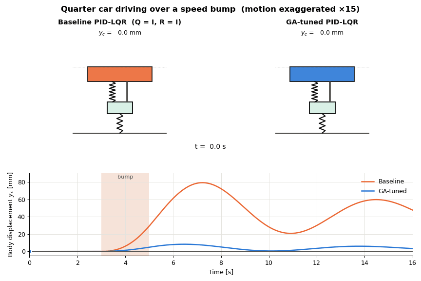

> **TL;DR:** A Genetic Algorithm searched the weighting matrices `Q` and `R` of an LQR design. The resulting
> gain was then converted into PID gains through integral-backstepping augmentation. In the speed-bump test, the
> GA-tuned controller cut the **peak body displacement by about 90 %** (79.2 mm → 8.2 mm). It also cut the
> **RMS body velocity by about 88 %**, compared with a baseline PID-LQR that uses `Q = I, R = I`.

---

## Table of contents

1. [Problem](#1-problem)
2. [System model](#2-system-model)
3. [Method](#3-method)
4. [Results](#4-results)
5. [Repository structure](#5-repository-structure)
6. [How to run](#6-how-to-run)
7. [Notes and limitations](#7-notes-and-limitations)
8. [References](#8-references)

---

## 1. Problem

An active suspension adds a controllable actuator force `F_a` between the car body and the wheel. The goal is to
keep the body still when the car drives over a speed bump, which improves ride comfort and stability.

LQR gives an optimal state-feedback gain for a chosen pair of weighting matrices `Q` and `R`. Choosing those weights
by hand, however, is mostly trial and error. In this project:

* the **LQR** design is turned into a **PID** controller through integral-backstepping augmentation (PID-LQR), and
* a **Genetic Algorithm (GA)** searches `Q` and `R` automatically. It minimises a cost built from time-domain
  performance: tracking error, overshoot, settling time and steady-state error.

## 2. System model

<p align="center">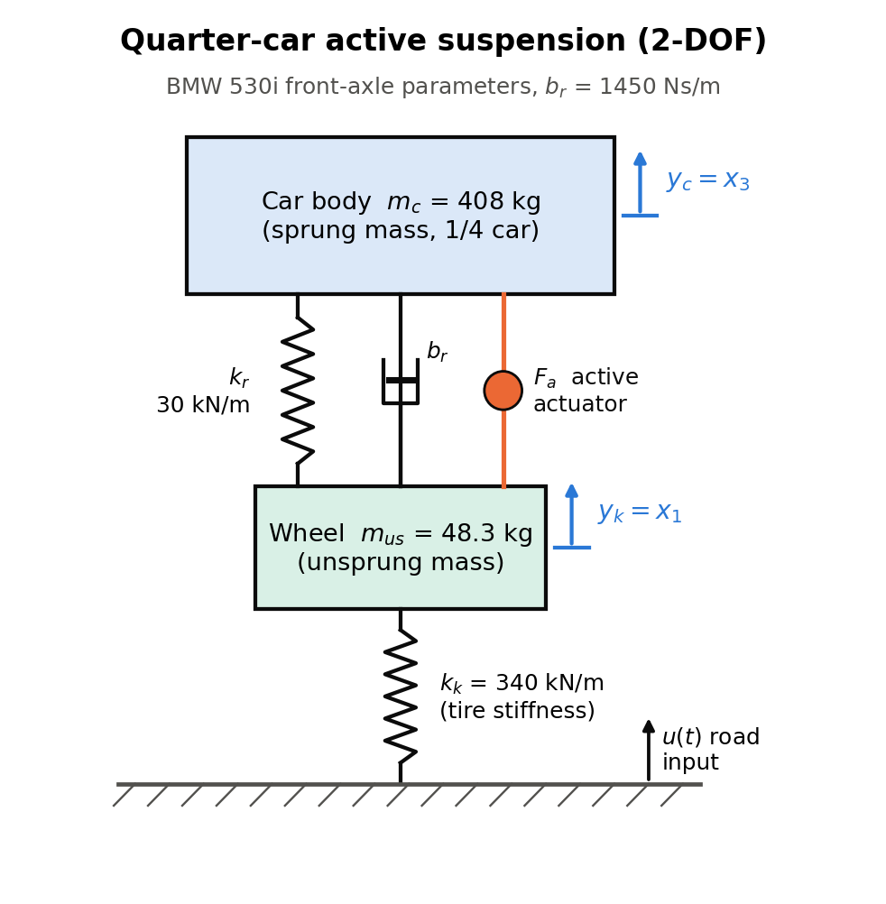</p>

The quarter car is a 2-DOF mass–spring–damper system. The equations of motion (Newton's second law) are:

```
m_k·ÿ_k = k_k(u − y_k) − k_r(y_k − y_c) − b_r(ẏ_k − ẏ_c) − F_a
m_c·ÿ_c = k_r(y_k − y_c) + b_r(ẏ_k − ẏ_c) + F_a
```

The state vector is `x = [y_k, ẏ_k, y_c, ẏ_c]ᵀ` (wheel position and velocity, body position and velocity), with
inputs `[F_a, u]ᵀ` and outputs `y = [y_c, ẏ_c]ᵀ`:

```
      ⎡     0          1        0       0    ⎤        ⎡   0       0     ⎤
      ⎢ −(k_k+k_r)/m_k −b_r/m_k  k_r/m_k b_r/m_k ⎥        ⎢ −1/m_k  k_k/m_k ⎥        ⎡0 0 1 0⎤
  A = ⎢     0          0        0       1    ⎥    B = ⎢   0       0     ⎥    C = ⎣0 0 0 1⎦
      ⎣   k_r/m_c    b_r/m_c −k_r/m_c −b_r/m_c ⎦        ⎣  1/m_c     0     ⎦
```

**Parameters (BMW 530i, front axle)**

| Symbol | Description | Value |
|---|---|---|
| `k_r` | Suspension spring constant | 30 kN/m |
| `b_r` | Suspension damping constant | 1450 Ns/m |
| `k_k` | Tire spring constant | 340 kN/m |
| `m_c` | Body mass (¼ car, sprung) | 408 kg |
| `m_us` | Wheel mass (unsprung) | 48.3 kg |

## 3. Method

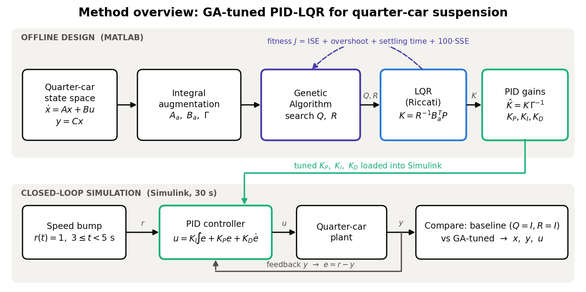

### 3.1 PID as state feedback (PID-LQR)

The PID law `u = K_I∫y dt + K_P y + K_D ẏ` can be rewritten as state feedback on the plant augmented with an
integrator at its input. With `ẏ = CAx + CBu` and `ÿ = CA²x + CABu + CBu̇`, this gives:

```
u̇ = K_x x + K_u u          (state feedback in the upper loop, pure integrator in the lower loop)

A_a = ⎡A  B⎤   B_a = ⎡0⎤    Γ = ⎡ C     0  ⎤
      ⎣0  0⎦         ⎣I⎦        ⎢ CA    CB ⎥
                                ⎣ CA²  CAB ⎦
```

<p align="center">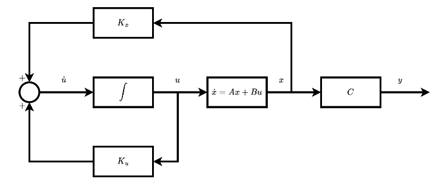</p>

An LQR gain `K` for `(A_a, B_a)` is computed from the Riccati equation, `AᵀP + PA − PBR⁻¹BᵀP + Q = 0`, with
`K = R⁻¹BᵀP`. That gain is mapped back to PID gains:

```
K̂  = K · Γ⁻¹
K_D = K̂(1,5:6) / (1 + K̂(1,5:6)·C·B)
K_P = K̂(1,3:4) · (1 − K_D·C·B)
K_I = K̂(1,1:2) · (1 − K_D·C·B)
```

### 3.2 Genetic Algorithm for Q and R

<p align="center">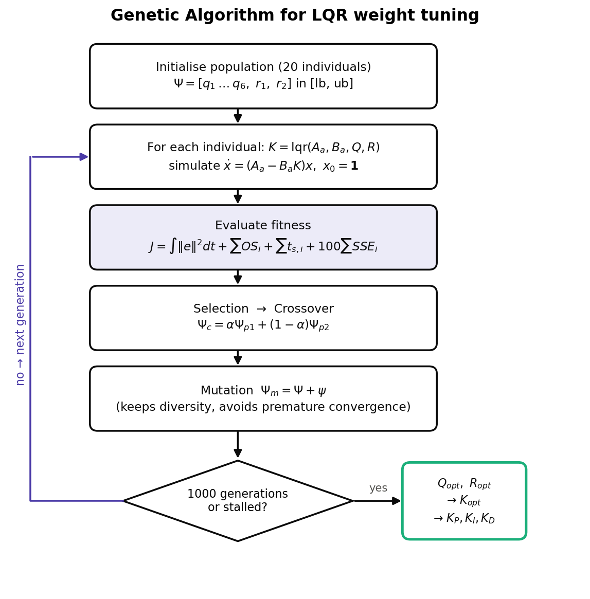</p>

| Setting | Value |
|---|---|
| Decision variables | `Ψ = [q₁ … q₆, r₁, r₂]` → `Q = diag(q)`, `R = diag(r)` |
| Bounds | `q ∈ [0.1, 100]`, `r ∈ [0.01, 10]` |
| Population / generations | 20 / 1000 (MATLAB `ga`) |
| Evaluation | closed loop `ẋ = (A_a − B_aK)x`, `x₀ = 1`, `t ∈ [0, 10] s` (`ode45`) |
| Fitness | `J = ∫‖e‖²dt + Σ Overshootᵢ + Σ SettlingTimeᵢ + 100·Σ SteadyStateErrorᵢ` |

Result reported in the paper:

```
Q_opt = diag(87.4999, 47.9164, 0.5189, 63.4103, 99.5451, 0.9337)
R_opt = diag(5.3421, 9.3203)
```

### 3.3 Simulation

<p align="center">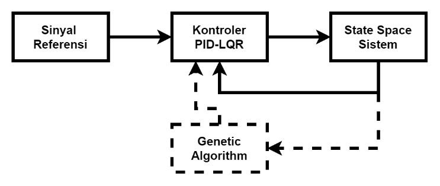</p>

Both controllers run side by side in Simulink for 30 s (`src/quarter_car_pid_lqr_sim.slx`). The test input is a
step of height 1 that is active between **3 s and 5 s** and represents the car driving over a speed bump.

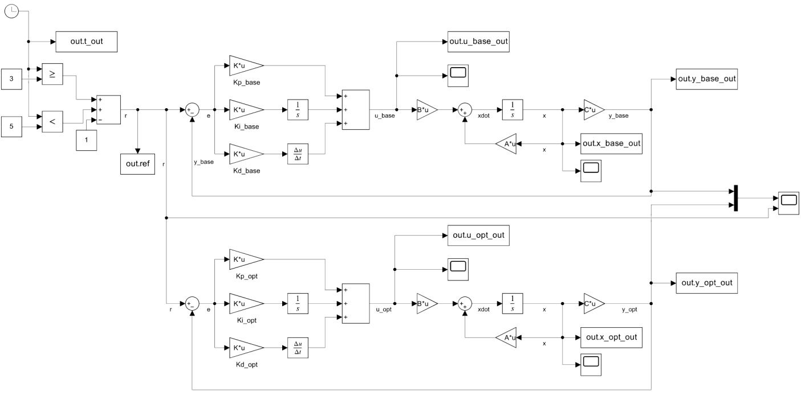

## 4. Results

All plots below were regenerated from the Simulink model by `src/export_results.m` and `tools/make_figures.py`.

### Body response

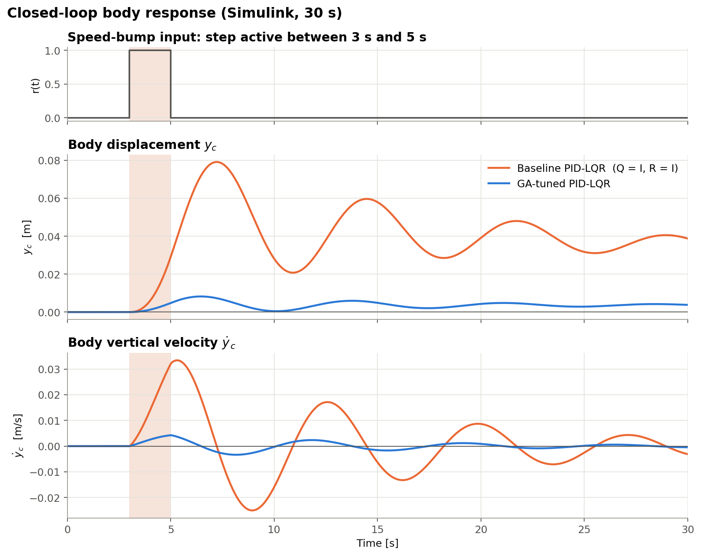

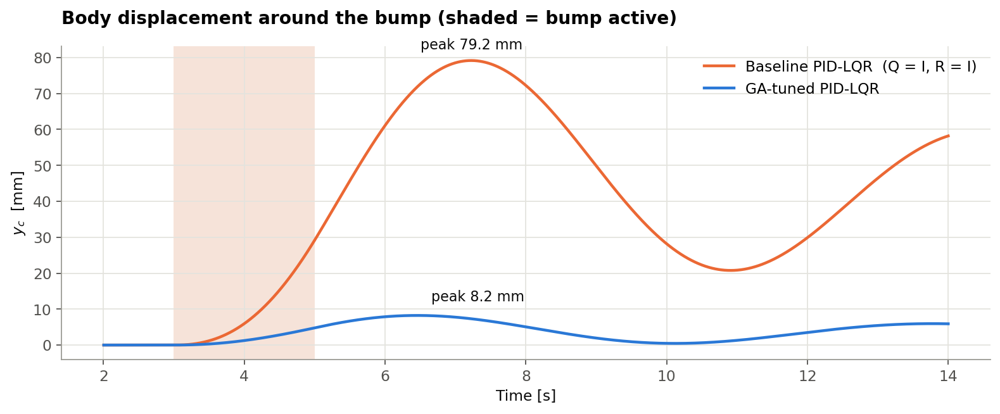

### Performance summary

| Metric | Baseline (`Q=I, R=I`) | GA-tuned | Reduction |
|---|---:|---:|---:|
| Peak body displacement \|y_c\| | 79.15 mm | 8.24 mm | **−89.6 %** |
| Peak body velocity \|ẏ_c\| | 33.39 mm/s | 4.25 mm/s | **−87.3 %** |
| Integral of squared y_c (ISE) | 51 146 mm²·s | 469 mm²·s | **−99.1 %** |
| RMS body velocity (comfort) | 11.89 mm/s | 1.48 mm/s | **−87.5 %** |
| Residual y_c at t = 30 s | 38.77 mm | 3.79 mm | **−90.2 %** |

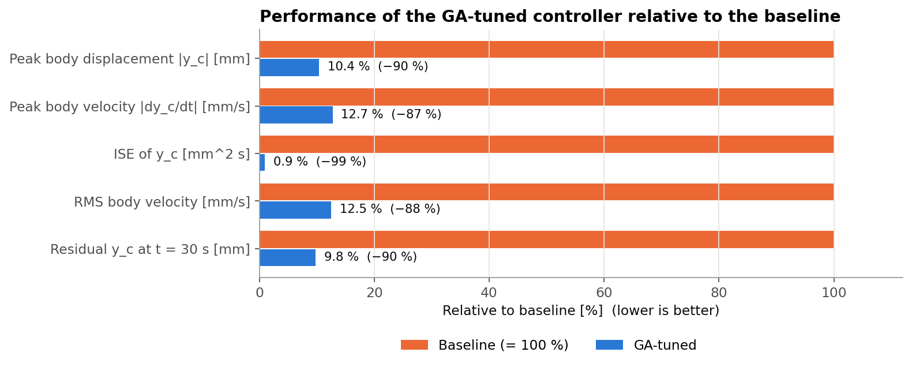

### All states

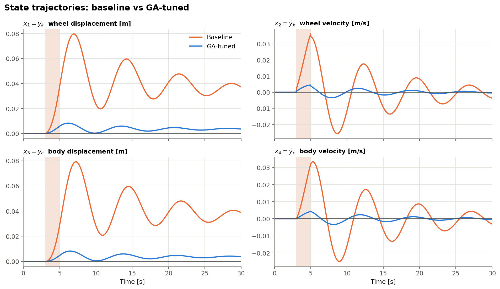

### Control effort

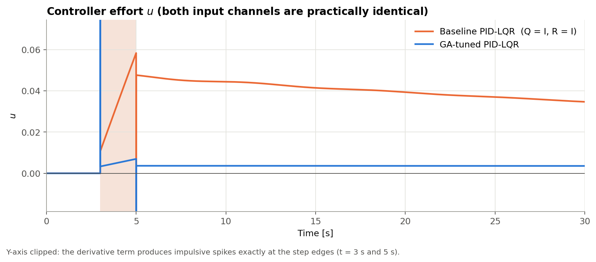

The GA-tuned controller needs **about 10× less control effort** after the bump. The baseline holds a large,
slowly decaying input.

### Stability

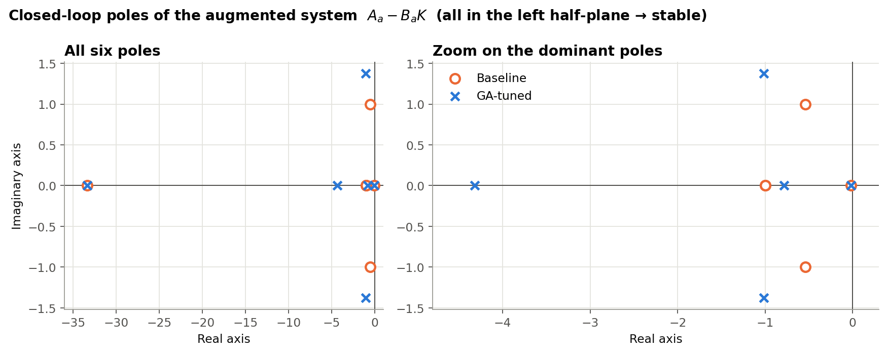

All closed-loop poles of both designs lie in the left half-plane, so both are stable. The GA moves the
dominant complex pair from `−0.54 ± 1.00j` to `−1.01 ± 1.38j`, which gives faster decay. It also moves a real pole
from `−1.0` to `−4.32`.

### Gains

| | Baseline | GA-tuned |
|---|---|---|
| `K_P` | `[0.00535, 0.00535]` | `[0.00166, 0.00166]` |
| `K_I` | `[0.01215, 0.01215]` | `[0.00092, 0.00092]` |
| `K_D` | `0.00203` | `0.00057` |

The full LQR gain matrices are in [`results/gains.txt`](results/gains.txt).

### GA convergence (from the original run)

<p align="center">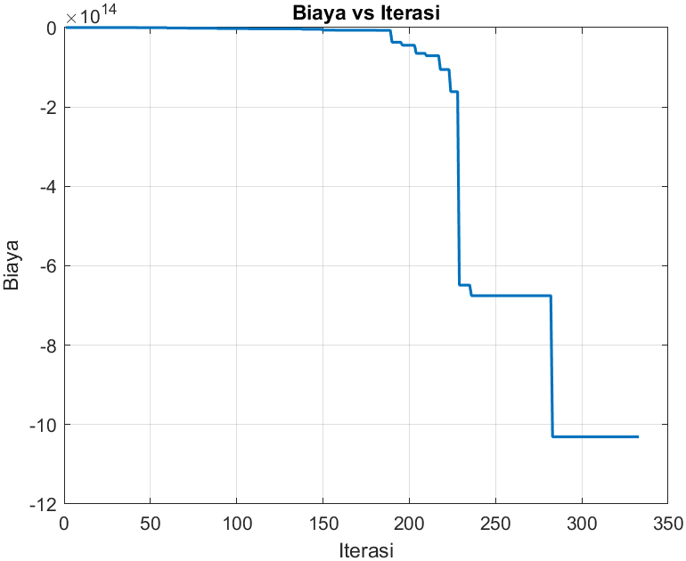</p>

## 5. Repository structure

```
suspension-control-quarter-car/
├── README.md
├── src/                                # MATLAB / Simulink
│   ├── main_ga_pid_lqr.m               # full pipeline: model → GA → PID-LQR → Simulink → plots
│   ├── export_results.m                # reproduces paper results (no GA toolbox needed) → results/
│   ├── ga_lqr_tuning.m                 # side experiment: GA-tuned plain LQR on the 4-state model
│   └── quarter_car_pid_lqr_sim.slx     # Simulink model (baseline and GA-tuned loops)
├── tools/                              # Python scripts that draw the README figures
│   ├── make_diagrams.py                # quarter-car schematic, architecture, GA flowchart
│   ├── make_figures.py                 # result plots and metrics.csv
│   └── make_animation.py               # quarter_car_bump.gif
├── results/                            # data exported from Simulink
│   ├── simulation_response.csv         # t, r, x, y, u for both controllers
│   ├── closed_loop_poles.csv
│   ├── gains.txt
│   └── metrics.csv
├── media/
│   ├── animations/                     # GIF
│   ├── figures/                        # generated figures
│   └── report/                         # figures taken from the report
└── docs/
    └── GA_PID-LQR_QuarterCar_Report.pdf  # full report (Indonesian)
```

## 6. How to run

**MATLAB (R2023b tested)** needs the Control System Toolbox and Simulink. The GA step also needs the
Global Optimization Toolbox.

```matlab
cd src
main_ga_pid_lqr     % full pipeline, re-runs the GA (results vary between runs)
export_results      % no GA: reuses Q_opt/R_opt from the paper and writes CSVs to ../results
```

**Python (figures and GIF)** needs Python 3.10 or newer.

```bash
pip install -r tools/requirements.txt
python tools/make_diagrams.py
python tools/make_figures.py
python tools/make_animation.py
```

## 7. Notes and limitations

* **The GA is stochastic.** `main_ga_pid_lqr.m` gives a different `Q_opt` and `R_opt` on each run. The figures in
  this README use the values reported in the paper, so they can be reproduced.
* **The overshoot term can be exploited.** The fitness divides by the steady-state value, and that value goes to
  0 for a regulator, so the term can become very large and negative. This explains the negative cost scale
  (about −10¹⁵) in the convergence plot. A more robust fitness would use `|peak|` relative to the initial
  condition, or a bounded overshoot term.
* **There is a slow mode.** Both designs keep a slow real pole at about −0.021, so `y_c` has not fully returned to
  zero at 30 s. The GA-tuned residual is about 10× smaller.
* **The bump is an idealised input.** It is a normalised step applied as the reference signal. The derivative
  term produces impulsive control spikes at its edges, and a filtered derivative or a smooth bump profile would
  avoid this.

## 8. References

1. K. Á. Kis, P. Korondi, G. Korsoveczki, I. Kocsis, K. Sarvajcz, I. Balajti, *Quarter car suspension state space
   model and full state feedback control for Real-Time Processing*, 2023.
2. E. Joelianto, *Linear Quadratic Control: A State Space Approach*, Automatic Control Engineering, 2017.
3. I. A. Herdian, I. Bintang, A. Nurfarid, *Perancangan Simulasi dan Analisis Kinerja Sistem Kontrol Optimal pada
   Active Quarter Car Suspension Orde-4*, 2024.

---

**Author:** Izma Alhazmi Herdian, Engineering Physics, Institut Teknologi Bandung
